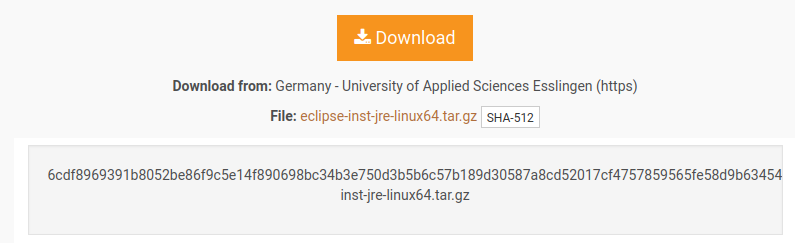

# 1. Required Software

## Visual Studio Code

## Eclipse Integrated Development Environment (IDE)

https://www.eclipse.org/downloads/

I installed **IDE 2022-12** 


and selected Eclipse IDE for Java developers


Need to check the downloaded file is trustworthy



To check this, we run the following command from a command window


We'll come back to this after we have finished installing Eclipse

Open a commmand window and change to the folder where you downloaded the installation file

```
(base) simon@minty22:~$ cd Downloads/
```

extract the file

```
(base) simon@minty22:~/Downloads$ tar xvf eclipse-inst-jre-linux64.tar.gz 
eclipse-installer/
eclipse-installer/readme/
eclipse-installer/readme/readme_eclipse.html
eclipse-installer/features/
eclipse-installer/features/org.eclipse.emf.edit
    .
    .
    .
    eclipse-installer/p2/org.eclipse.equinox.p2.engine/profileRegistry/DefaultProfile.profile/1669830388583.profile.gz
```
we now have a new folder `eclipse-installer` 
```    
(base) simon@minty22:~/Downloads$ ls
eclipse-installer  eclipse-inst-jre-linux64.tar.gz  RS_2006-03  RS_2006-03.zst

```
change to this folder and run the installation script
``` 
(base) simon@minty22:~/Downloads$ cd eclipse-installer/
(base) simon@minty22:~/Downloads/eclipse-installer$ ls
artifacts.xml  eclipse-inst      features  p2       readme
configuration  eclipse-inst.ini  icon.xpm  plugins
(base) simon@minty22:~/Downloads/eclipse-installer$ ./eclipse-inst 
``` 

This will open the following window and give a range of different options for the IDE. We are going to use the **Eclipse IDE for Java Developers**


Go ahead and click on this option, then on install, and finally on **Accept Now** to accept the User Agreement. This will start the installation process


### sha512
```
$ more sha512/bad_bunny.txt 
|-----------|
| DON'T     |
| TRUST     |
| THE       |
| BUNNY!    |
|-----------|
(\__/) ||
(•ㅅ•) ||
/ 　 づ
```
